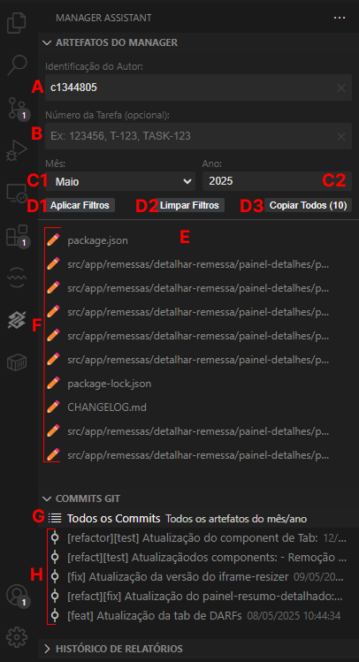

# Manager Assistant - Extensão VS Code

> **🧪 VERSÃO ALPHA - EM TESTE**  
> Esta extensão está em desenvolvimento ativo. Feedback e relatórios de bugs são muito bem-vindos!

Uma extensão para Visual Studio Code que automatiza a captura e formatação de artefatos do Git para relatórios mensais de prestação de contas.

## 📦 Instalação Rápida

1. Baixe o arquivo `manager-assistant-0.1.0.vsix`
2. Abra o terminal na pasta do arquivo
3. Execute:
```bash
code --install-extension manager-assistant-0.1.0.vsix
```
4. Reinicie o VS Code

## 🚀 Como Usar

### 1️⃣ Abra um Projeto Git
- Abra qualquer projeto Git no VS Code
- O painel "MANAGER ASSISTANT" aparecerá na barra lateral

### 2️⃣ Configure os Filtros



- **A** - **Identificação do Autor**: Digite sua ID (ex: c1344805)
- **B** - **Número da Tarefa**: Digite o número da tarefa (opcional)
- **C1** - **Mês**: Selecione o mês desejado
- **C2** - **Ano**: Digite o ano (ex: 2025)

### 3️⃣ Gere os Artefatos

- **D1** - Clique em **"Aplicar Filtros"**
- **G** - Clique em **"Todos os Commits"** na seção COMMITS GIT
- **E** - Visualize a lista de artefatos gerados
- **D3** - Clique em **"Copiar Todos"** para copiar todos os artefatos

### 4️⃣ Use o Resultado

Cole o resultado copiado em seu relatório mensal. O formato será:

```
+projeto-nome/src/app/remessas/detalhar-remessa/painel-detalhes/painel-detalhes.component.ts#c1344805
+projeto-nome/src/app/component.html#a1b2c3d4e5
projeto-nome/src/app/existing-file.ts#x9y8z7w6v5
```

## 🔍 Entendendo os Artefatos

| Símbolo | Significado |
|---------|-------------|
| `+` | Arquivo **novo** no período selecionado |
| Sem `+` | Arquivo **atualizado** no período |
| `#hash` | Hash do último commit do arquivo |

## ⚡ Funções Rápidas

### Captura Rápida
- **"Capturar último commit"**: Pega artefatos do commit mais recente
- **"Capturar staged"**: Pega arquivos em staging area

### Filtros Automáticos
- **Por Autor**: Mostra apenas seus commits
- **Por Tarefa**: Filtra por número de tarefa/ticket
- **Por Período**: Filtra por mês e ano específicos

### Cópia Individual
- **F** - Clique no ícone 📋 ao lado de qualquer arquivo para copiá-lo individualmente

## 🛠️ Comandos do VS Code

Pressione `Ctrl+Shift+P` e digite:

- `Manager Assistant: Capturar Último Commit`
- `Manager Assistant: Capturar Staged`
- `Manager Assistant: Atualizar`

## 🆘 Resolução de Problemas

### ❌ Extensão não aparece
- ✅ Verifique se abriu um projeto Git
- ✅ Reinicie o VS Code

### ❌ Nenhum artefato encontrado
- ✅ Verifique se há commits no repositório
- ✅ Confira os filtros aplicados (autor, período)
- ✅ Teste sem filtros primeiro

### ❌ Hashes vazias (#)
- ✅ Use "Todos os Commits" após aplicar filtros
- ✅ Verifique se o período tem commits

### ❌ Filtros não funcionam
- ✅ Verifique o formato da ID do autor
- ✅ Teste com períodos diferentes

## 🧪 Como Reportar Problemas (Alpha)

Se encontrar bugs ou problemas:

1. **Capture screenshot** do problema
2. **Anote os passos** que levaram ao erro
3. **Inclua informações** do seu ambiente:
   - Versão do VS Code
   - Sistema operacional
   - Tamanho do repositório

**Template rápido:**
```
Bug: [Descrição breve]
Passos: 1. Fiz X, 2. Cliquei Y, 3. Erro Z
Ambiente: VS Code [versão], [Windows/Mac/Linux]
```

## 📋 Exemplo Completo - Relatório Mensal

### Cenário: Relatório de Maio 2025

1. **Configurar**:
   - Autor: `c1344805`
   - Mês: `Maio`
   - Ano: `2025`

2. **Aplicar Filtros** ➜ **Todos os Commits** ➜ **Copiar Todos**

3. **Resultado**:
```
+meu-projeto/src/app/new-feature/component.ts#1a2b3c4d5e
+meu-projeto/src/app/new-feature/service.ts#1a2b3c4d5e
meu-projeto/src/app/existing/updated-file.ts#6f7g8h9i0j
meu-projeto/README.md#p6q7r8s9t0
```

4. **Colar no relatório mensal** ✅

## 🔧 Desinstalação

```bash
code --uninstall-extension manager-assistant
```

---

## 📞 Suporte e Feedback

**Leonardo Raposo**  
BBTS - Banco do Brasil Tecnologia e Serviços

> 🧪 **Esta é uma versão alpha.** Seu feedback ajuda a melhorar a extensão!

---

*Versão: 1.1.0-alpha | Status: Em testes*